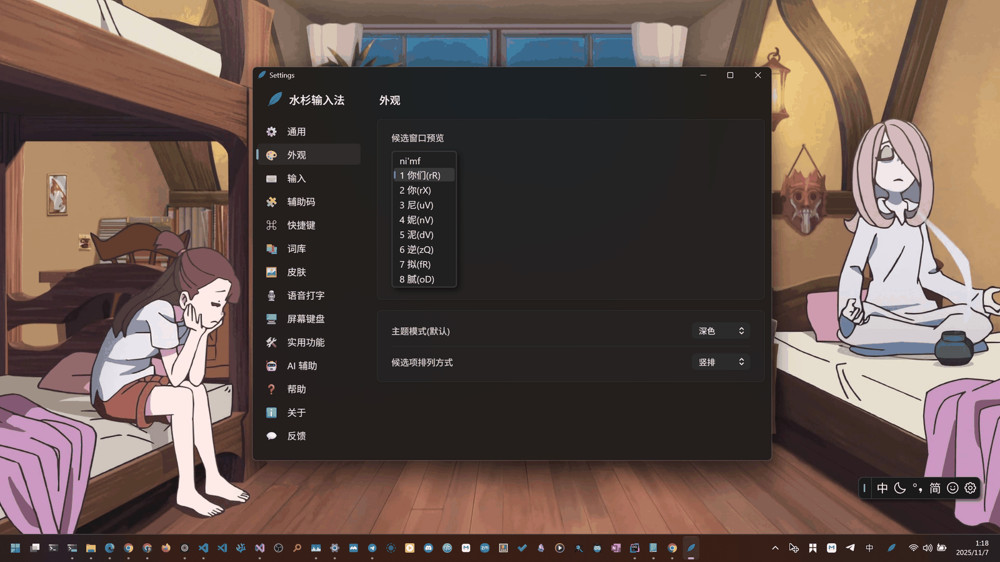
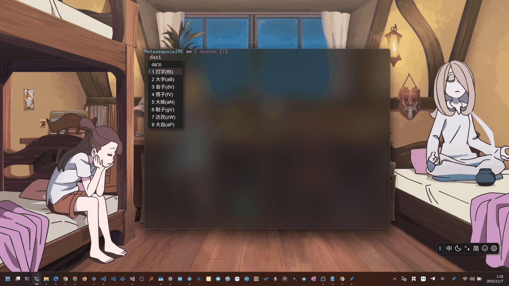
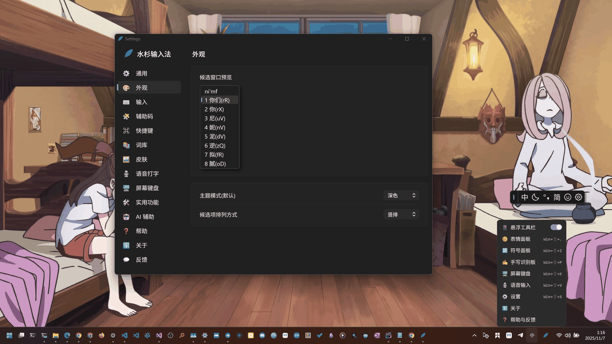
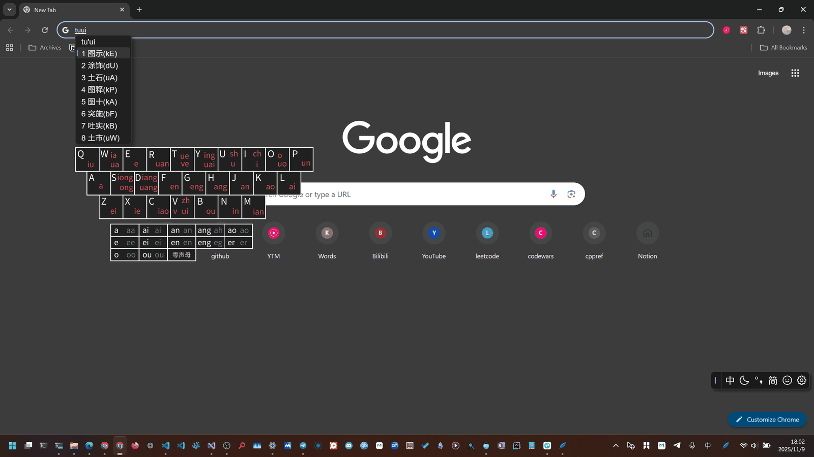

# Metasequoia IME(水杉输入法)

<!-- badges:start -->

<!-- badges:end -->

水杉输入法起初是一个 Windows 上的纯 TSF 输入法，现在各平台前端共用同一套 C++ 输入引擎：Windows 公开内测中，macOS 已发布，Linux（IBus）已有发布包，iOS 前端正在开发中。

## 用户文档

| 平台 | 阅读入口 | 范围 |
| --- | --- | --- |
| Windows 10 / 11 | [Windows 使用指南](guides/windows.md) | 安装、设置、输入模式、词库导入导出、语音和排障 |
| macOS 12+ | [macOS 使用指南](guides/macos.md) · [语音输入](guides/macos-voice.md) | 安装、原生设置、快捷键、数据与卸载 |
| Linux / IBus | [Linux 使用指南](guides/linux.md) | 安装启用、设置、桌面工具、语音命令与排障 |
| iOS | [Apple 平台仓库](https://github.com/metasequoiaime/MSIME-Apple) | 开发中的键盘扩展，以实现仓进展为准 |

Windows 指南是官网对应正文的唯一来源。修改用户说明请在本仓提交，MSIME-Web 通过固定的 Docs 子模块渲染；构建/API 说明仍由各代码仓库维护。指南按已提交源码核对，具体安装版本可能有所不同，请结合 Release 阅读。

仓库边界与数据来源见[公共仓库与平台架构](architecture/repositories.md)。

## 开源代码

平台前端：

- Windows TSF 端: <https://github.com/metasequoiaime/MSIME-Windows>
- Apple 平台（macOS / iOS）: <https://github.com/metasequoiaime/MSIME-Apple>
- Linux（IBus）: <https://github.com/metasequoiaime/MSIME-Linux>

引擎与数据：

- 输入法引擎: <https://github.com/metasequoiaime/MSIME-Engine>
- Server 端: <https://github.com/metasequoiaime/MSIME-Windows/tree/main/server>
- 输入法词典与构建器: <https://github.com/metasequoiaime/MSIME-Engine/tree/main/dictionary>
- 自定义词典包: <https://github.com/metasequoiaime/MSIME-Engine/tree/main/dictionary/custom>
- 辅助码: <https://github.com/metasequoiaime/MSIME-Engine/tree/main/helpcode>
- n-gram 拼音联想算法: <https://github.com/metasequoiaime/Metasequoia-n-gram>
- 原安卓谷歌拼音输入法引擎: <https://github.com/metasequoiaime/Google-PinyinIME-Rev>

界面与工具：

- 原生 GUI 框架: <https://github.com/metasequoiaime/MSIME-Windows/tree/main/ui>
- UI 界面（WebView2 资源）: <https://github.com/metasequoiaime/MSIME-Windows/tree/main/ui-html>
- 公共语音模块: <https://github.com/metasequoiaime/MSIME-Engine/tree/main/voice>
- 输入法日志: <https://github.com/metasequoiaime/MSIME-Windows/tree/main/log>
- 安装器: <https://github.com/metasequoiaime/MSIME-Windows/tree/main/installer>
- 皮肤示例: <https://github.com/metasequoiaime/metasequoia-ime-skin-example>

## 截图

以下为历史界面示例，实际外观随版本和皮肤变化。

双拼初学者可以使用以下这个带有键位提示的皮肤：

## 特性

共享引擎提供本地拼音、双拼、五笔查询、候选选择、辅助码与词频学习；平台前端负责原生输入交互。日语、快捷模式、联网候选和语音等功能的入口与随包数据因平台而异，详见各平台指南。

Windows 提供 TSF 输入、候选窗口、工具栏和设置页面；macOS 提供原生候选与设置、本地或云端语音；Linux 提供 IBus 集成、GTK 设置和独立语音命令。本地输入不要求配置云服务；联网功能的默认开关和数据去向请分别查看指南。

## 路线图

已发布功能与变更以各平台 Release 为准；开发计划在对应仓库 Issues 中讨论，不在文档中承诺未经确认的交付日期。可参与 Windows 兼容性、Apple/iOS 前端、Linux 桌面集成、公共引擎和词库维护，入口见下方贡献说明。

## 手动构建

本仓只有 Markdown 文档，无需编译。应用构建请使用对应实现仓的当前说明：

- [Windows 构建入口](https://github.com/metasequoiaime/MSIME-Windows#readme)
- [Apple 构建与测试](https://github.com/metasequoiaime/MSIME-Apple#readme)
- [Linux 构建与测试](https://github.com/metasequoiaime/MSIME-Linux#readme)
- [公共引擎与数据构建](https://github.com/metasequoiaime/MSIME-Engine#readme)

## 贡献

文档结构、核对方法和官网同步流程见[文档贡献指南](CONTRIBUTING.md)。

欢迎参与。方向不限于写代码——整理词库、补文档、做本地化、测兼容性、录教程同样算贡献。可参与的方向按类别列在[招募开源开发者](https://github.com/metasequoiaime/.github/blob/main/RECRUITING.md)，通用约定见[贡献指南](https://github.com/metasequoiaime/.github/blob/main/CONTRIBUTING.md)。

开源的一个理由是隐私：输入法能看到用户输入的一切，这件事不该靠承诺保证，而该能被任何人直接读代码检查。

## 感谢

- 开源签名证书(50 欧元/年的 Sign in Cloud 版本): <https://www.certum.eu/en/>

## 许可协议

GPL-3.0.

<!-- star-history:start -->
## Star History

<!-- star-history:end -->
