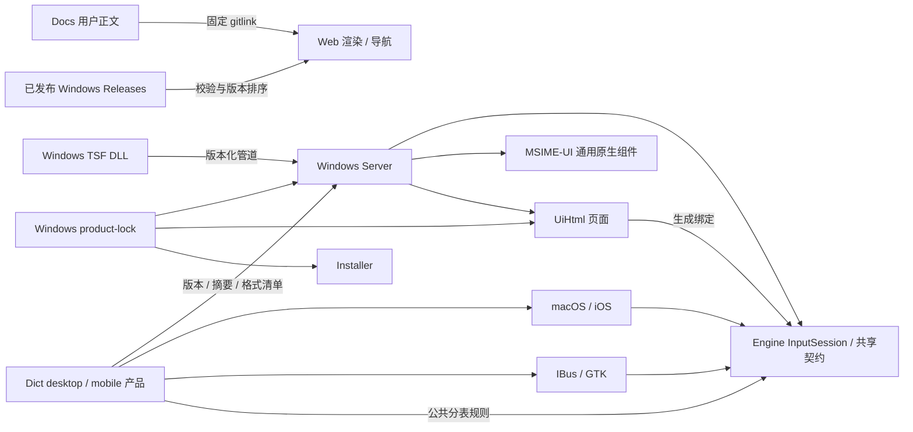

# 跨仓架构改造实施记录（历史）

归档自 [.github 的固定版本](https://github.com/metasequoiaime/.github/blob/012b5b9421102adffff4a25e29a8ccdd1411390b/ARCHITECTURE-WORK.md)。以下状态与证据只代表记录当时，不随当前实现更新；现状见[公共架构](../architecture/repositories.md)及[平台接入矩阵](../architecture/platform-adoption.md)。

目标：按架构审查优先级完成改造，并交付可审查的跨仓 PR。此记录以 2026-09-06 的实际实现和验证为准；早期工作已被后续提交替代。

> **本文是历史记录，结构部分已被同日稍晚的合仓取代。** 下面的仓库划分、mermaid 图和「无需先物理合仓」的判断，描述的是合仓之前的状态。Windows 端的 Server、GUI 框架、页面、安装器随后并入 MSIME-Windows，词库、辅助码、语音并入 MSIME-Engine，原仓库已归档为只读。当前的职责划分见 [AGENTS.md](https://github.com/metasequoiaime/.github/blob/main/AGENTS.md)。
>
> 表格中指向已归档仓库的 PR 和 CI 链接仍然有效——归档只是只读，不删除内容。这些链接是当时验证的证据，因此原样保留，不改写成迁移后的路径。

## 架构关系

保留 DLL/Server 进程隔离和各平台原生宿主边界。通过共同接口、固定产物和组合验证消除跨仓漂移，无需先物理合仓。（合仓在此之后仍然发生了，但合的是仓库不是进程：DLL 与 Server 至今隔着版本化命名管道。合仓解决的是维护边界，这一段说的「不靠合仓替代协议契约」依然成立。）

## 按优先级落地

| 项目 | 原问题 | 最终实现 |
|---|---|---|
| 1. 发布组合 | 单仓固定版本不能复现整套产品，代码与数据可能错配 | Windows 锁定全部一方源码输入及词库摘要；构建、打包、重建和来源清单使用同一组合；发布门禁验证依赖 commit 可从各仓默认分支到达 |
| 2. 跨仓协议 | IPC/语音/Web 消息存在重复定义和隐式兼容假设 | Engine contracts 为唯一来源；主连接版本/能力/请求关联协商；TS/JS/C++ 生成 Web 绑定及双方校验；真实 Win32/x64 管道测试覆盖旧/新客户端、版本拒绝和重连 |
| 3. 输入行为 | Server 与平台会话各自推进组合、管理组词和本地查询 | 共享 InputSession 负责候选推进、规范拼音、跨次选择学习、本地模式与在线代次；Server 仅作异步宿主适配；Apple/Linux 同步选择保留未消费后缀，宿主退出使用公共 finish_composition |
| 4. 词库产品 | 移动压缩在平台复制，格式/来源和分表规则分散 | Dict 提供公开 desktop/mobile profile，记录来源、格式/引擎兼容、特性及摘要；建表、插入、查询、设置写入和回放共用 Engine 格式契约；SQLite 冻结为可独立分发的 DELETE journal 文件 |
| 5. UI 边界 | 多后端持有重复候选展示业务，通用 GUI 职责不明确 | 候选视图模型共享，原生小窗口/WebView 设置页的职责和兼容退出条件明确；删除旧会话和孤立 D2D 原型；MSIME-UI 增加业务依赖防回流检查 |
| 6. 规范与发布信息 | Windows 专属规则扩散，用户正文与更新版本重复维护 | 组织 AGENTS 归 .github，平台保留本地规则；Docs 为用户指南唯一正文，Web 固定版本渲染；更新元数据从正式发布事实生成并防止旧版重发导致回退 |

## 最终提交与验证

下表的 CI 对应指定提交，不把旧版本的绿勾当作新版本的证据。

| 仓库 / PR | 提交 | 实际验证 |
|---|---|---|
| [Engine #23](https://github.com/metasequoiaime/MSIME-Engine/pull/23) | `6bd2254` | 本地 13 项根 CTest；[三平台及共享 Web 契约 CI 全部通过](https://github.com/metasequoiaime/MSIME-Engine/actions/runs/33978274087) |
| [Server #33](https://github.com/metasequoiaime/MSIME-Server/pull/33) | `331034d` | [最终固定 Engine 的 Windows CI 全部通过](https://github.com/metasequoiaime/MSIME-Server/actions/runs/33978299387)；先前真实词库 237 项测试和 30 组 Web 契约通过 |
| [Windows #148](https://github.com/metasequoiaime/MSIME-Windows/pull/148) | `ce2aa1a` | 本地 13 项锁拒绝测试、契约 pin/验证器检查通过；[最终整产品 CI 全部通过](https://github.com/metasequoiaime/MSIME-Windows/actions/runs/33978351581)，包括真实 Server/词库及 Win32/x64 管道探针 |
| [Dict #14](https://github.com/metasequoiaime/MSIME-Dict/pull/14) | `689beb7` | [CI 全部通过](https://github.com/metasequoiaime/MSIME-Dict/actions/runs/33978299424)：实际完整 desktop/mobile 构建、3 项 Python 回归、固定 Engine 消费真实产物 |
| [Apple #248](https://github.com/metasequoiaime/MSIME-Apple/pull/248) | `3699a0b` | 本地 macOS 构建及 32 CTest、最后桥接回归、iOS 模拟器构建通过；实际发布数据获取/公开 mobile profile 通过；[原生 CI 全部通过](https://github.com/metasequoiaime/MSIME-Apple/actions/runs/33978508012) |
| [Linux #60](https://github.com/metasequoiaime/MSIME-Linux/pull/60) | `484d24e` | [Ubuntu 24.04/26.04 × amd64/arm64 原生矩阵全部通过](https://github.com/metasequoiaime/MSIME-Linux/actions/runs/33978370911)，含 IBus、控制器、包及固定数据检查；18 项锁测试通过 |
| [UI #6](https://github.com/metasequoiaime/MSIME-UI/pull/6) | `18260ea` | [Windows 构建、布局及依赖边界检查通过](https://github.com/metasequoiaime/MSIME-UI/actions/runs/33975171290) |
| [UiHtml #7](https://github.com/metasequoiaime/MSIME-UiHtml/pull/7) | `1f22eef` | [构建和固定绑定检查通过](https://github.com/metasequoiaime/MSIME-UiHtml/actions/runs/33978300018)；真实浏览器 12 个静态页加载协议 v1，候选/工具栏/菜单/设置实际消息通过 |
| [Installer #4](https://github.com/metasequoiaime/MSIME-Installer/pull/4) | `1896c3b` | [自身 CI 通过](https://github.com/metasequoiaime/MSIME-Installer/actions/runs/33977365583)；Windows 产品 CI 用该固定源码执行实际完整/轻量打包脚本，验证公共运行时、词库清单、架构资源及拒绝缺失输入 |
| [Docs #3](https://github.com/metasequoiaime/MSIME-Docs/pull/3) | `4c48a5d` | Web 使用此固定正文生产构建通过 |
| [Web #12](https://github.com/metasequoiaime/MSIME-Web/pull/12) | `fbe32d4` | 最终生产构建和 3 项更新元数据接受/拒绝测试通过；[PR CI](https://github.com/metasequoiaime/MSIME-Web/actions/runs/33978194242) 和 Pages 预览通过 |
| [实施记录 #3](https://github.com/metasequoiaime/.github/pull/3) | 见 PR 最终提交 | 组织规范已在 #1 合入；本 PR 汇总依赖顺序和验证记录 |

关键行为回归：分段选择后保留剩余拼音并学习完整规范词条；取消清空组词进度；标点、快捷键透传、输入方案切换、iOS 回车/英文切换结束整段输入；无正文的临时模式不触发虚假的空文本插入；过期在线结果拒绝。实际词库消费者验证七/八/九音节的创建、查询与回放，并查询英文、快捷短语和表情。

验证中发现并修复：Server 将未构建的 GUI 独立测试误注册到自己的 CTest；复制 WAL 模式英文数据库后首个只读查询失败；短候选提交丢失剩余拼音；模式前缀被误作一次空提交。Linux 的 /proc 工具定位检查在原生 Linux CI 验证，本地 macOS 只运行其余可移植测试。

## 合并顺序与边界

1. Engine #23、UI #6、Dict #14（Dict 依赖 Engine）；Docs #3 可独立先行。
2. Server #33、UiHtml #7、Apple #248、Linux #60、Installer #4、Web #12，遵循各 PR 链接的生产者依赖。
3. Windows #148 最后合入整产品锁；若 squash/rebase 改变生产者 commit 的可达性，刷新并重测组合后再发布。
4. 组织规范 #1 已合入；实施记录 #3 可独立审查。

较早的基础协议、共享格式和 Linux 数据消费改造已经合入，本表列出剩余的最终交付 PR。输入法安装、注册、PR 合并及发布没有在本任务中执行。

完成状态：六项实现、对应回归和最终跨平台/整产品 CI 均已通过；12 个最终 PR 已提供实际验证证据与相互依赖顺序。最终核验时，10 个实现 PR 已通过其他操作合入；Docs #3 和实施记录 #3 仍开放待审查。
