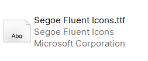
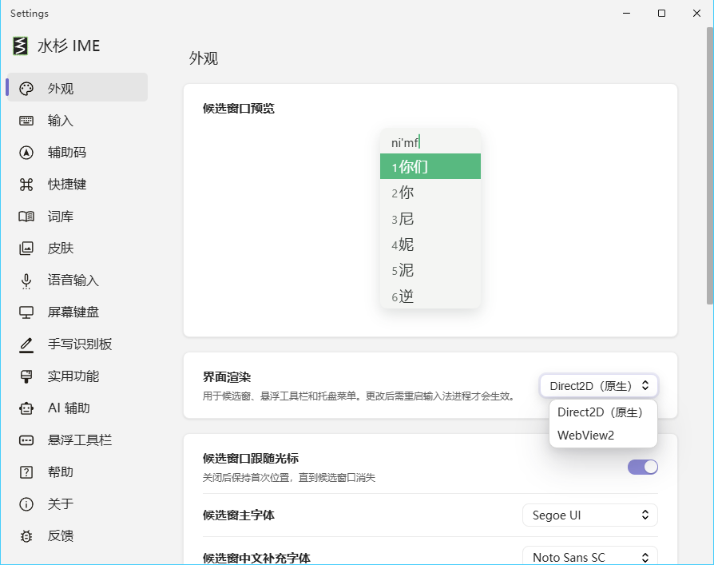
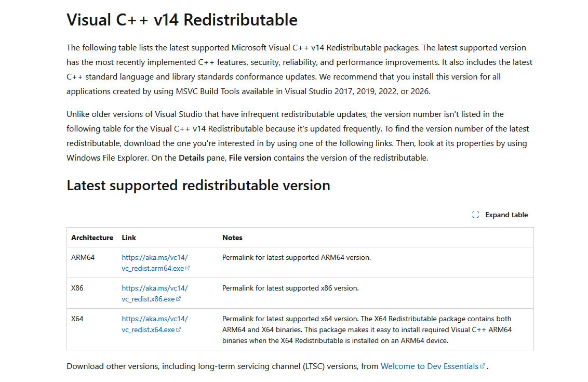
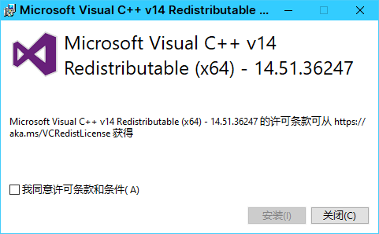
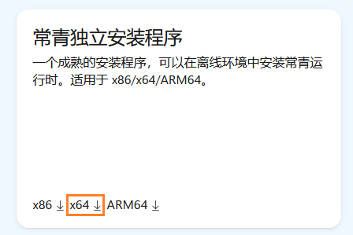

# 常见问题 Q&A

从实际反馈中整理的排查办法。先找到与你相同的现象，再按步骤检查；这里以 Windows 为主，其他平台请查阅对应指南。

## 字体与显示

### 打字时汉字显示成方框，应该安装什么字体？

先区分是**候选文字变成方框**，还是只有悬浮工具栏的图标变成方框。汉字缺字时，优先检查“设置 → 外观 → 候选窗中文补充字体”：选择系统中已安装、能显示这些汉字的中文字体；若使用的字体未安装，先安装对应字体，再重新打开输入法选择它。主字体主要用于西文，不能代替中文补充字体。

如果只有少数生僻字显示方框，需要覆盖这些字的字体，换一个不含这些字的字体仍不会解决。如果候选窗正常、上屏到某个软件才变成方框，则应检查那个软件的字体设置。排查后仍有问题，请附具体字符、所选字体及截图。

这是一条字体排查建议，不能凭方框现象认定是同一个 Bug。设置项依据：[Windows 指南 · 候选窗样式](https://msime.app/docs/?platform=windows#候选窗样式)。工具栏图标问题见下一问。

### Windows 10 悬浮工具栏图标变成方框或空白，但按钮仍能点击？

**有临时处理办法，修复仍在跟进。** Windows 10、v0.5.4 的反馈中，维护者确认 Direct2D 工具栏使用了系统未自带的 `Segoe Fluent Icons` 图标字体。这与候选汉字的字体不同。

可以先补齐图标字体，再检查渲染方式：

1. 打开微软的 [Design resources 字体下载页](https://learn.microsoft.com/en-us/windows/apps/design/downloads/#fonts)，下载 **Segoe Fluent Icons**。
2. 解压 `Segoe-Fluent-Icons.zip`，右键字体文件，选择“安装”。
3. 安装完成后按 `Ctrl + Shift + Alt + R` 重启输入法服务，再检查图标。
4. 若仍显示方框，在“设置 → 外观”将“界面渲染”从 **Direct2D（原生）**改为 **WebView2**，保存后再次重启服务。

注意：`Ctrl + Shift + Alt + T` 是**退出**服务，不是重启；误按后可从开始菜单重新启动水杉输入法。Windows 11 自带此字体；微软说明独立下载版可能缺少较新的图标，安装后仍异常时可尝试上述 WebView2 方案。

来源：[Windows #232](https://github.com/metasequoiaime/MSIME-Windows/issues/232)、[社区图文步骤 · Discussion #258](https://github.com/metasequoiaime/MSIME-Windows/discussions/258)、[微软字体说明](https://learn.microsoft.com/en-us/windows/apps/design/iconography/segoe-fluent-icons-font#how-do-i-get-this-font)。快捷键以 [Windows 指南](https://msime.app/docs/windows/#快捷键)为准。


工具栏图标缺失时的表现。



解压后安装 Segoe Fluent Icons.ttf 字体。


安装字体并重启后，工具栏图标恢复。



仍有问题时，在外观设置中切换界面渲染为 WebView2。

截图由 WhiteCloud-OuO 提供，来自 [Discussion #258](https://github.com/metasequoiaime/MSIME-Windows/discussions/258)。界面可能随版本调整。


### 候选窗太大、字太小，或每页候选数量不合习惯？

在“设置 → 外观”调整“候选窗字号”“候选窗预编辑字号”和“每页候选项数量”。文档所核对的界面支持字号 12～32 像素、每页 3～9 项；也能切换横向或纵向排列。候选数量只影响分页，不会减少总候选结果。

如果调整后仍有文字遮挡，请记录缩放比例、分辨率、渲染方式和截图，作为显示问题反馈，不要反复删除词库。

来源：[已关闭的 Windows #15](https://github.com/metasequoiaime/MSIME-Windows/issues/15)、[外观设置指南](https://msime.app/docs/?platform=windows#外观)。

## 安装与启动

### 安装后切换不了输入法，Server 反复退出，或设置窗口一闪即关？

先检查 **Microsoft Visual C++ x64 运行库**。Server 和设置程序是 64 位程序，只安装 x86 版本并不够。

1. Windows 10 可在“设置 → 应用 → 应用和功能 → 程序和功能”检查已安装的 Microsoft Visual C++ Redistributable 项目，确认是否包含 **x64**。
2. 打开[微软官方下载页](https://learn.microsoft.com/en-us/cpp/windows/latest-supported-vc-redist)，选择 x64 的 `vc_redist.x64.exe`，运行并按提示安装；已安装时可尝试“修复”。
3. 完成后重启 Windows，再用 `Win + Space` 切换到水杉输入法。

仍有问题时，先保存错误提示和事件查看器记录。不要先清空用户数据，否则可能丢失词条和排查依据。

依据：[Windows 指南 · 安装后无法使用或设置窗口闪退](https://msime.app/docs/?platform=windows#安装后无法使用或设置窗口闪退)、[社区图文排查 · Discussion #258](https://github.com/metasequoiaime/MSIME-Windows/discussions/258)。


已安装的运行库应包含 x64。



在微软下载页选择 X64 对应的链接。



运行安装程序，阅读并同意许可后安装；版本号以当前下载为准。

截图由 WhiteCloud-OuO 提供，来自 [Discussion #258](https://github.com/metasequoiaime/MSIME-Windows/discussions/258)。界面可能随版本调整。


### 安装好了，但找不到设置入口？

先按 `Win + Space` 切换到水杉输入法，再右键语言栏的输入法图标，或使用悬浮工具栏里的设置入口。

首次安装后看不到状态图标，可先重启 Windows，再切换到水杉。#30 的反馈者确认重启后图标恢复；这是该反馈的有效办法，不代表所有“设置打不开”都由同一原因造成。若窗口能出现但随即退出，请按上一问检查运行库。

来源：[已关闭的 Windows #30](https://github.com/metasequoiaime/MSIME-Windows/issues/30)。

### 候选窗或设置页空白，和汉字显示方框一样吗？

两种现象应分开排查。**窗口整体空白或不出现**时，先确认 Metasequoia IME Server 正在运行，再检查 Microsoft Edge WebView2 Runtime，并对照所装版本的发布说明。**窗口中有候选位置、但字符是方框**时，优先检查字体。

**输入法能启动，但点击设置没有反应**时，缺少或损坏的 WebView2 Runtime 是一种可能原因。可打开[微软 WebView2 下载页](https://developer.microsoft.com/microsoft-edge/webview2/#download)，在 **Evergreen Standalone Installer（常青独立安装程序）**下选择 **x64**，接受许可后下载安装。安装完成后重启 Windows，再尝试打开设置；无需为此安装开发用 SDK。

这是社区讨论提供的排查路径，不代表所有设置打不开的问题都由 WebView2 导致。如果只有某个应用无法显示或上屏，先在记事本中对比，反馈时写清应用名称、版本及是否以管理员身份运行。

依据：[Windows 指南 · 更新、备份与故障排查](https://msime.app/docs/?platform=windows#更新备份与故障排查)、[社区图文排查 · Discussion #258](https://github.com/metasequoiaime/MSIME-Windows/discussions/258)、[微软 WebView2 Runtime 说明](https://learn.microsoft.com/en-us/microsoft-edge/webview2/concepts/distribution#the-evergreen-runtime-distribution-mode)。



WebView2 下载页：选择 Evergreen Standalone Installer 下的 x64。

截图由 WhiteCloud-OuO 提供，来自 [Discussion #258](https://github.com/metasequoiaime/MSIME-Windows/discussions/258)。界面可能随版本调整。


### 设置页提示找不到 imesettings 的服务器 IP，应该改 DNS 吗？

不要把 `imesettings` 当作需要访问的公网网站。#94 报告的是 v0.0.9.2 设置页的本地资源加载失败：开关代理均出现错误，维护者当时仅初步判断与中文路径有关，并未在讨论中给出经确认的通用修复步骤。

先检查安装是否完整，按对应 Release 更新；若仍复现，记录安装路径是否含中文、系统与输入法版本、代理开启状态和错误页截图。不要照搬未知的 hosts 或 DNS 修改方案。设置整体空白时也可参考上一问检查 WebView2。

来源：[已关闭的 Windows #94](https://github.com/metasequoiaime/MSIME-Windows/issues/94)。关闭不等于已验证所有环境恢复正常。

## 输入与快捷键

### 全拼输入 fangan，为什么先显示 fan'gan，而不是“方案”？

这是拼音切分歧义。可以明确输入 `fang'an`：先打 `fang`，再打半角单引号 `'`，再打 `an`。

维护者在 #41 说明，0.0.9.2+ 已加入相应备选，“方案”应出现在候选中，但首选切分仍可能是 `fan'gan`，并非把所有歧义都改为最长匹配。若新版仍没有“方案”，反馈完整输入串、版本和候选截图。

来源：[已关闭的 Windows #41](https://github.com/metasequoiaime/MSIME-Windows/issues/41)、[手动分词 #18](https://github.com/metasequoiaime/MSIME-Windows/issues/18)。

### “先”等常用字突然不见了，要删除用户词库吗？

先更新并复测，不要直接删除用户词库。#36 的历史问题中，卸载重装一度恢复，但几天后再次出现；维护者后来依据反馈定位问题，并建议更新到 v0.0.9。

若当前版本仍出现，记录输入编码、缺失的字、实际候选及最近进行过的词库操作。需要重置前，先按指南导出用户词库并备份本机数据。用户词库可能含个人输入，不要直接上传到公开 Issue。

来源：[已关闭的 Windows #36](https://github.com/metasequoiaime/MSIME-Windows/issues/36)、[备份指南](https://msime.app/docs/?platform=windows#更新备份与故障排查)。

### 英文单词置顶后，为什么还是排在中文后面？

先确认当前处于**中文模式下的中英混输**，还是**独立英文候选模式**。中文混输中，英文候选默认不抢占中文首位；可以用 `Ctrl + Shift + E` 进入独立英文候选模式，再比较同一个词的排序。

#110 中反馈者还指出“手动置顶仍不能成为首位”。这部分不能简单解释为用户没开置顶，也不能因为 Issue 已关闭就认定已修复。若仍复现，请附输入编码、希望置顶的词、实际顺序和当前模式。

来源：[已关闭的 Windows #110](https://github.com/metasequoiaime/MSIME-Windows/issues/110)、[Windows 输入指南](https://msime.app/docs/?platform=windows#输入)。

### Git Bash 里按 Shift 不能切换中英文？

先确认终端宿主。#32 的修复针对 `mintty.exe`，维护者建议在 0.0.8 及以上版本复测。如果 Git Bash 运行在 Windows Terminal 中，则不属于这条修复覆盖的宿主。

仍失效时，写清是独立 Git Bash / mintty，还是 Windows Terminal 中的 Git Bash，并附版本。可在“设置 → 快捷键 → 中英文切换”选择其他已支持的切换键进行对比。

来源：[已关闭的 Windows #32](https://github.com/metasequoiaime/MSIME-Windows/issues/32)。

### 中英文状态总跳回去，或切换快捷键和别的软件冲突？

先检查“设置 → 快捷键 → 中英文切换”中启用的 `Shift`、`Ctrl`、`Ctrl + Alt + Space`，关闭冲突的项，再对比测试。`Ctrl + Space` 由 Windows 管理，需要在 Windows 的“输入语言热键”中修改。

也检查是否安装了其他中英文自动切换或键盘增强工具。#16 的一位反馈者发现与 Capsense 冲突，关闭后恢复；这只是已确认的一个冲突案例，不代表所有状态跳变都由该工具造成。

来源：[已关闭的 Windows #16](https://github.com/metasequoiaime/MSIME-Windows/issues/16)、[快捷键指南](https://msime.app/docs/?platform=windows#快捷键)。

### 可以用微软双拼，或一直输出英文标点吗？

可以。在“设置 → 输入”选择双拼及微软双拼方案；“固定标点状态”可启用“始终使用英文标点”。它与“始终使用中文标点”互斥，启用后不会随中英文输入模式自动改变标点状态。

如果安装版本没有这些选项，请先对照发布说明更新。微软双拼已经包含在维护者确认的支持列表中，无需手动编辑方案表。

来源：[已关闭的 Windows #31](https://github.com/metasequoiaime/MSIME-Windows/issues/31)、[已关闭的 #39](https://github.com/metasequoiaime/MSIME-Windows/issues/39)。

### 同音字太多，能否输入一个词，只取其中一个字？

在“设置 → 输入”开启“以词定字”。选中目标候选后，按 `[` 上屏第一个汉字，按 `]` 上屏最后一个汉字。例如用容易找到的词来定位首字或末字。

此功能取的是首尾汉字，不能用它直接选出三字或更长词语的中间字。

来源：[已关闭的 Windows #14](https://github.com/metasequoiaime/MSIME-Windows/issues/14)、[以词定字指南](https://msime.app/docs/?platform=windows#以词定字)。

## 翻译、数据与反馈

### 候选词的英文释义不准确，可以自己纠正吗？

可以添加本地覆盖文件：`%LOCALAPPDATA%\metasequoiaime\custom_translations.txt`。使用 UTF-8 文本，每行以真正的 Tab 分隔源词和释义；不要把空格或文字“Tab”当成分隔符。

```text
你好	hello
谢谢	thank you
```

相同源词取最后一条，覆盖内容优先于内置释义。保存后重启输入法。#75 记录了部分高频词的覆盖修正，但不意味着全部翻译数据都已正确；错译仍可附具体词例反馈。

来源：[已关闭的 Windows #75](https://github.com/metasequoiaime/MSIME-Windows/issues/75)、[相关反馈 #71](https://github.com/metasequoiaime/MSIME-Windows/issues/71)、[候选词翻译指南](https://msime.app/docs/?platform=windows#候选词翻译)。

### 快捷短语可以批量导入吗？

可以。在“实用功能 → 快捷短语”中使用“批量导入”。导入 UTF-8 纯文本，不加表头，每行用真正的 Tab 分隔编码、短语和权重，例如：

```text
mail	example@example.com	10
```

来源格式不同时，先转换为水杉支持的格式，不能把任意输入法的词库文件直接当成快捷短语文件导入。返回失败行号时，检查列数和 Tab，修正后再导入。

来源：[已关闭的 Windows #29](https://github.com/metasequoiaime/MSIME-Windows/issues/29)、[快捷短语指南](https://msime.app/docs/?platform=windows#快捷短语k-模式)。历史 Issue 的入口名称可能与新版不同，以当前指南和安装版本为准。

### 断网还能打字吗？云候选、翻译或语音失败怎么办？

本地词库输入仍可使用。先关闭出问题的联网功能，确认普通输入正常，再核对服务地址、模型、凭据和网络状态。语音、在线翻译等依赖配置的服务，不能把服务不可用等同于输入法整体无法使用。

需要离线输入时，关闭云候选、AI 联想、在线翻译、在线语音识别及润色等联网选项。Windows 指南注明云候选默认开启，会发送正在输入的拼音串。反馈网络错误时遮挡 Token、SecretKey 等凭据。

依据：[Windows 指南 · 更新、备份与故障排查](https://msime.app/docs/?platform=windows#更新备份与故障排查)、[云候选](https://msime.app/docs/?platform=windows#云候选)。

### 上面的方法都没解决，反馈时需要提供什么？

准备输入法版本、操作系统版本、输入方案、复现步骤、预期结果和实际结果，附能说明现象的截图。应用兼容问题请增加应用名称、版本、权限状态；显示问题增加字体、缩放比例和渲染方式。

先在[Windows Issues](https://github.com/metasequoiaime/MSIME-Windows/issues)搜索相同问题，再提交 Bug。功能改进可用[官网需求上报](https://msime.app/feedback/)。macOS 和 Linux 请分别查看[macOS 指南](https://msime.app/docs/?platform=macos)、[Linux 指南](https://msime.app/docs/?platform=linux)。

公开前遮挡截图中的个人内容、日志里的凭据，不要直接附完整用户词库或配置文件。安全漏洞请按[安全策略](https://github.com/metasequoiaime/.github/blob/main/SECURITY.md)私下报告。

本页于 2026-09-08 核对 Windows 已关闭 Issue、维护者回复及现行指南，并补充仍开放的字体问题 #232。历史版本号只说明对应反馈的范围，不代表当前最新版；是否进入你使用的安装包，以 Release 为准。
